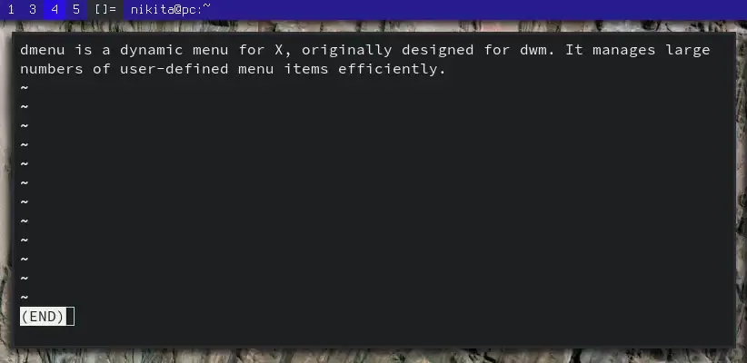

# dmenu-translate

[dmenu](https://tools.suckless.org/dmenu/) script for quick text translation with [translate-shell](https://github.com/soimort/translate-shell/)



## Dependencies

* [dmenu](https://tools.suckless.org/dmenu/) (or any other dmenu-like utility)
* trans from [translate-shell](https://github.com/soimort/translate-shell/)
* notify-send

## Installation

### Manual

```sh
git clone https://github.com/NikitaIvanovV/dmenu-translate
cd dmenu-translate
sudo make install
```

Uninstall with `sudo make uninstall`

### AUR

If you are an Arch Linux user, you can install [`dmenu-translate-git`](https://aur.archlinux.org/packages/dmenu-translate-git/) AUR package.

```sh
yay -S dmenu-translate-git
```

## Usage

Just run `dmenu-translate` and the menu will appear:

1. Enter text to translate or choose X11 selection
2. Select language to translate text into
    * Or select `[Define]` option to view definition of a word
3. View translation in a new terminal window or copy it to clipboard

I bound `Super-Ctrl-t` to call the script on my dwm build.
So, whenever I encounter a word I don't know, I can select it with a mouse and get its definition or translation very quickly.
You might want to do something similar on your system.

## Configuration

By default, only English and Russian languages appear in the menu.
You can alter this behavior by editing a configuration file located at `~/.config/dmenu-translate/config.conf`.
Run the script at least once to generate the file with all possible settings.

For reference, here is the configuration file:

<!-- CONFIG -->
```sh
# Languages that appear in the menu
TRANS_LANGS='ru en'

# You can change the following settings to replace dmenu
# with a different utility or set your options
DMENU_TEXT=''
DMENU_LANG=''
DMENU_NEXT=''

# Set this to any value if you want always copy the
# translation
ALWAYS_COPY=

# Clipboard command must recieve text from standard input
CLIP_CMD='xclip -i -r -selection clipboard'
```
<!-- CONFIG -->
